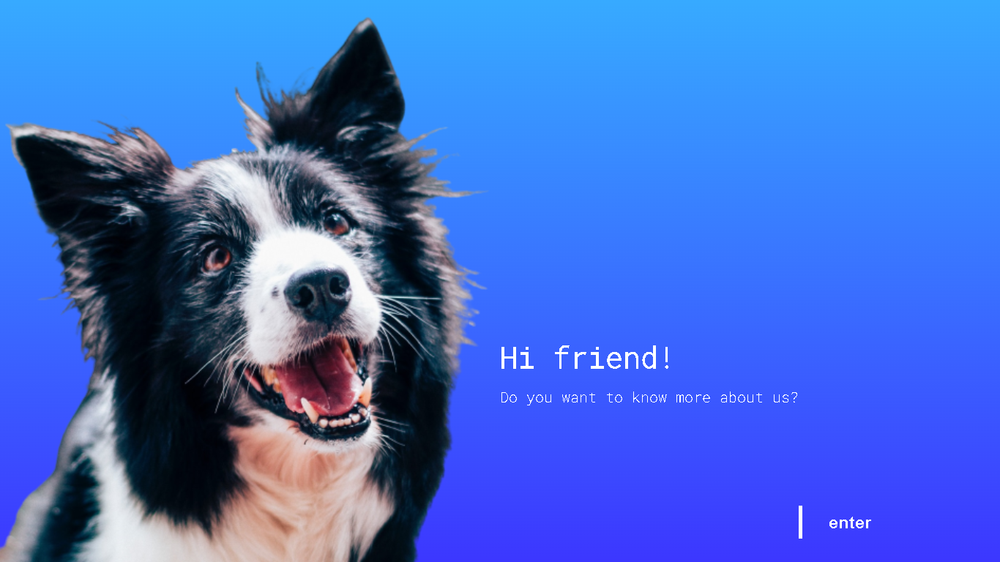
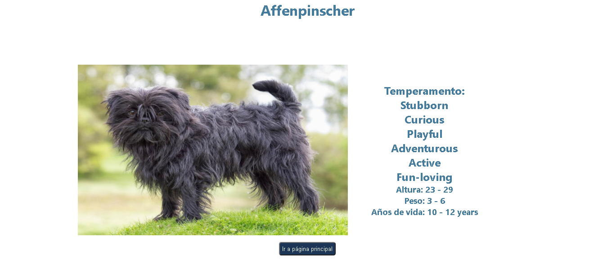

# Doggies

## Acerca de

La idea general es crear una aplicación en la cual se puedan ver distintas razas de perros junto con información relevante de las mismas utilizando la api externa [the dog api](https://thedogapi.com/) y a partir de ella poder, entre otras cosas:

  - Buscar perros
  - Filtrarlos / Ordenarlos
  - Agregar nuevos perros


## Objetivos del Proyecto

- Construir una App utlizando React, Redux, Node y Sequelize.
- Afirmar y conectar los conceptos aprendidos en la carrera.
- Aprender mejores prácticas.
- Aprender y practicar el workflow de GIT.

__IMPORTANTE:__ Es necesario contar minimamente con la última versión estable de Node y NPM. Asegurarse de contar con ella para poder instalar correctamente las dependecias necesarias para correr el proyecto.

Actualmente las versiónes necesarias son:

 * __Node__: 12.18.3 o mayor
 * __NPM__: 6.14.16 o mayor

Para verificar que versión tienen instalada:

> node -v
>
> npm -v

## BoilerPlate - Instrucciones

El boilerplate cuenta con dos carpetas: `api` y `client`. Abrir la consola en la ruta de estas carpetas y ejecutar `npm install`. Posteriormente ejecutar `npm start` 

En `api` crear un archivo llamado: `.env` que tenga la siguiente forma:

```
DB_USER=usuariodepostgres
DB_PASSWORD=passwordDePostgres
DB_HOST=localhost
```

Reemplazar `usuariodepostgres` y `passwordDePostgres` con tus propias credenciales para conectarte a postgres. 

Adicionalmente será necesario que creen desde psql una base de datos llamada `dogs`


#### Tecnologías usadas:
- [ ] React
- [ ] Redux
- [ ] Express
- [ ] Sequelize - Postgres

# Capturas del proyecto
## - Landing page
<p>
  
</p>

## - Página principal
<p>
  
</p>

## - Formulario controlado para crear nueva raza 
<p>
  
</p>

## - Detalle
<p>
  
</p>